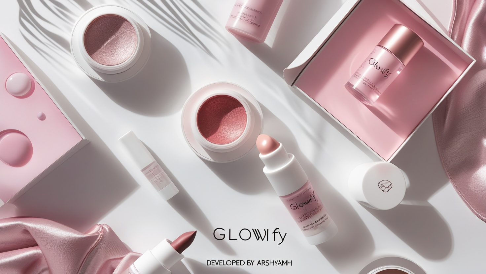

# Glowify 💄✨  
A sleek and modern beauty products website built with **HTML, CSS, JavaScript, and Bootstrap**. Glowify provides an elegant platform for exploring and discovering beauty products effortlessly.  

## 📌 Features  
✅ **Product Categorization** – Smart product suggestions for a better shopping experience  
✅ **Simple & Elegant Design** – Clean UI for easy navigation  
✅ **Built with HTML, CSS, JS & Bootstrap** – Ensuring a smooth and interactive experience  
✅ **Frontend Only** – No backend, just a stylish and functional interface  

## 🛠️ Technologies Used  
- HTML  
- CSS  
- JavaScript  
- Bootstrap  

## 📥 Installation & Usage  
No installation required! Just open the `index.html` file in your browser and start exploring.  

## 🎨 Design & Demo  
🔗 [View Project Demo](https://arshiya-mh.github.io/Glowify-/)

## 🖼️   

## 📜 License  
This project is open-source and free to use.  

🚀 **Developed by Arshiya MH**  
